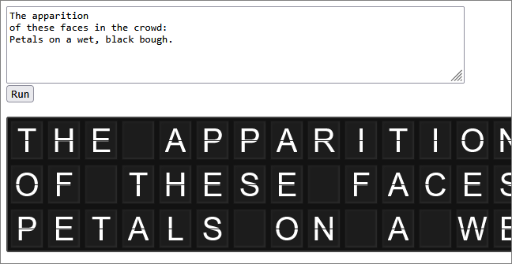

# Split-Flap Demo

See [split-flap display](https://en.wikipedia.org/wiki/Split-flap_display) for more information about split-flap message boards.

This demo was inspired by the following examples:

 - https://gist.github.com/veltman/f2b2a06d4ffa62f4d39d5ebac5ceeef0
 - https://github.com/paulcuth/departure-board

In this case, the transition from one letter to another is faked by displaying the top half of the letter a few milliseconds before the bottom half of the letter.

The gap between the top half and bottom half of each letter doesn't work very well for smaller font sizes, but there are two approaches to choose from:

 - force a gap between the top half and bottom half divs;
 - draw a horizontal line through each letter.

The JavaScript launches an array of Promises to handle transitions for each cell.

Demo: https://jsfiddle.net/kmqe73zd/

Further discussion: https://northcoder.com/post/another-splitflap-display-board/
